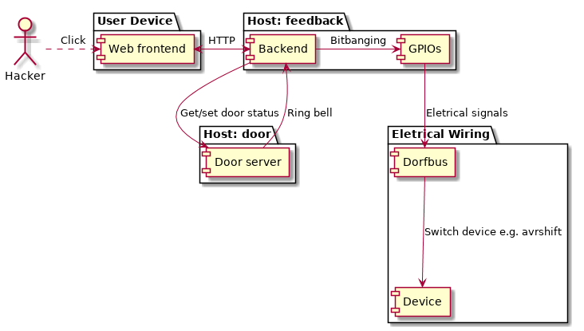
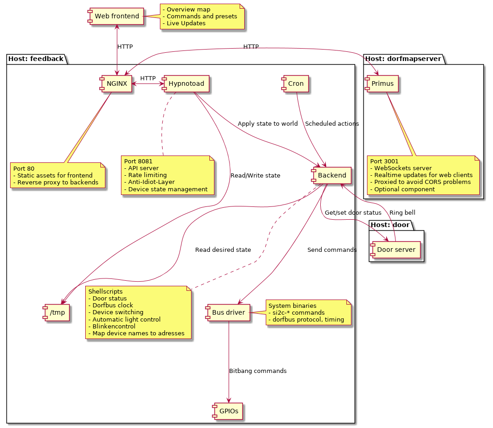

# dorfmap backend

The [dorfmap](https://wiki.chaosdorf.de/Lichtsteuerung) backend runs on [Raspbian 9](https://www.raspbian.org/) and can be installed with a debian package that contains all necessary binaries, scripts and configuration files.

This repository contains the **backend**.
The **web frontend** and the **API server** can be found in the [chaosdorf/dorfmap](https://github.com/chaosdorf/dorfmap/) repository.

## Backend architecture

The dorfmap is accessible in the chaosdorf network via HTTP and works with all modern browsers.
It shows a floorplan with all available devices.
Users can toggle devices individually, or use presets.
For example, when **shutdown** is triggered, all devices are disabled at once.
When the user performs an action, the web frontend sends a HTTP request to the API server.

The request first reaches nginx and is proxied to the API server.

The **API server** provides the REST-like dorfmap API to the outside world, implements rate limiting, enforces combinations of what can be toggled and what not, etc.
Due to certain design decisions from the past, the dorfbus currently only supports writes, so it is not possible to retrieve the status from connected devices.
Because of this, the last known state for all output channels is stored in a bunch of files and directories in `/tmp`.
The API server reads the current dorfmap state directly from all state files.
When a device is toggled, the API server first writes the desired state to the state file, and then calls into shell scripts provided by the backend to apply the new state to the dorfbus.

The **backend** is implemented as simple shell scripts.
It provides a mapping between human-readable names and actual device/pin adresses on the dorfbus.
Data is sent to the dorfbus using the `si2c-bitwrite` or `si2c-bytewrite` bus drivers.
A locking mechanism is used to prevent concurrency problems caused by multiple clients requesting state changes simultaneously.

The **bus drivers** are simple C programs that implement the eletrical dorfmap protocol.
Data is sent using bitbanging of Raspberry Pi GPIO pins.

## Development environment

Vagrant and VirtualBox required, then run

    $ vagrant up

To build the package

    $ vagrant ssh
    $ cd /vagrant
    $ gbp buildpackage -us -uc

When the build has finished, the package can be found at `/`.

## Deployment

    $ ./build-deb
    $ fab deploy:0.02
